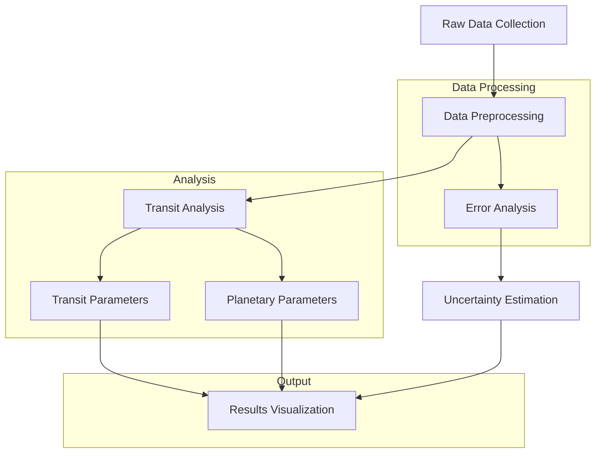
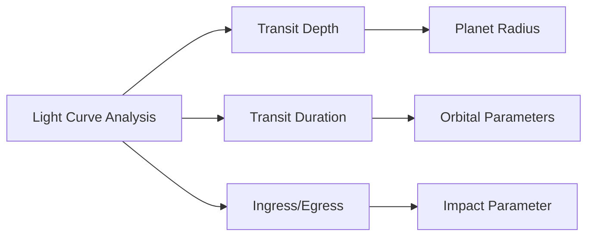
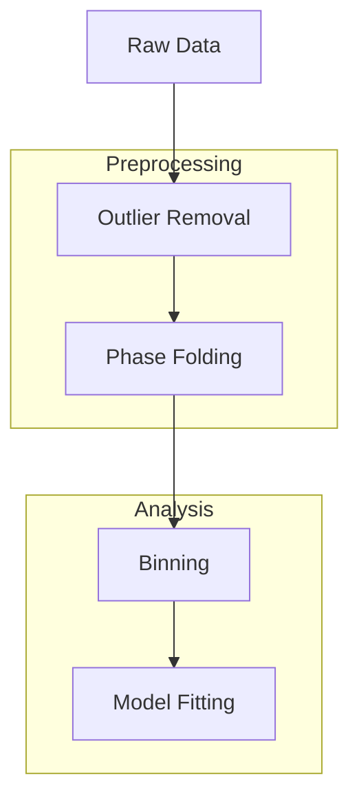

# HD 209458b Transit Analysis Pipeline 🌟

A comprehensive Python pipeline for analyzing transit observations of HD 209458b, the first confirmed transiting exoplanet. This project processes photometric data from the Richard S. Perkin Observatory to characterize the planetary system's properties.

<div align="center">


*Transit Method Animation (Credit: NASA)*
</div>

## Target System: HD 209458

- **Star Type**: G0V (Sun-like star)
- **Distance**: 153 light-years
- **Constellation**: Pegasus
- **Discovery Year**: 1999
- **Discovery Method**: Radial Velocity, confirmed by Transit

### HD 209458b (Osiris)
- **Type**: Hot Jupiter
- **Orbital Period**: 3.52474859 ± 0.00000038 days
- **Discovery**: First confirmed transiting exoplanet
- **Historical Significance**: First exoplanet with detected atmosphere

## Analysis Pipeline



## Light Curve Components



## Installation

```bash
# Clone the repository
git clone https://github.com/yourusername/HD209458b-transit-analysis.git

# Navigate to project directory
cd HD209458b-transit-analysis

# Install requirements
pip install -r requirements.txt
```

## Data Format

The pipeline expects photometric data in the following format:

```
HJD Relative_Flux Relative_Flux_Uncertainty Accepted
2453344.6466211 1.009855 0.008501 1
```

Key columns:
- `HJD`: Heliocentric Julian Date
- `Relative_Flux`: Normalized stellar flux
- `Relative_Flux_Uncertainty`: Measurement uncertainties
- `Accepted`: Data quality flag (1 for good data)

## Usage

```python
# Run the main analysis script
python transit_analysis.py
```

### Output Files

The pipeline generates several output files in the `output` directory:
- `transit_curve_PLC.png`: Transit light curve plot
- `binned_transit_PLC.png`: Phase-binned light curve
- `transit_summary.csv`: Derived parameters
- `detailed_results.json`: Complete analysis results

## System Parameters

From NASA Exoplanet Archive:

### Stellar Parameters
- Mass: 1.12 ± 0.02 M☉
- Radius: 1.20 ± 0.06 R☉
- Temperature: 6065 ± 50 K
- Metallicity: 0.02 ± 0.02 [Fe/H]

### Planetary Parameters
- Mass: 0.69 ± 0.02 MJ
- Radius: 1.38 ± 0.02 RJ
- Orbital Period: 3.52474859 ± 0.00000038 days
- Semi-major axis: 0.04707 ± 0.00046 AU
- Inclination: 86.71 ± 0.05 degrees

## Data Processing Steps



## Results Validation


Our analysis pipeline results are validated against:
- Published literature values
- NASA Exoplanet Archive data
- Independent analyses from other observatories

## Repository Structure

```
HD209458b-transit-analysis/
├── data/
│   └── raw/                 # Raw observation files
├── output/                  # Analysis results and plots
├── src/                     # Source code
├── docs/                    # Documentation
├── requirements.txt         # Dependencies
└── README.md               # This file
```

## Author

* **Md Khairul Islam**
* Institution: Hobart and William Smith Colleges, Geneva, NY
* Major: Robotics and Computer Science
* Contact: khairul.islam@hws.edu

## Acknowledgments

* **Leslie Hebb**, Associate Professor of Physics at Hobart and William Smith Colleges
* Richard S. Perkin Observatory
* Hobart and William Smith Colleges
* King's Lane, Geneva, NY 14456

## Data Sources

Primary data for this project comes from:
- Richard S. Perkin Observatory observations
- NASA Exoplanet Archive
- Published literature sources

## References

1. Henry et al. 2000, "A Transiting '51 Peg-like' Planet", ApJ, 529, L41
2. Charbonneau et al. 2000, "Detection of Planetary Transits Across a Sun-like Star"
3. NASA Exoplanet Archive, HD 209458b System
4. Mandel & Agol 2002, "Analytic Light Curves for Planetary Transit Searches"
5. Seager & Mallén-Ornelas 2003, "A Unique Solution of Planet and Star Parameters from an Extrasolar Planet Transit Light Curve"


## Contributing

Contributions are welcome! Please feel free to submit pull requests or open issues for improvements.

1. Fork the repository
2. Create your feature branch (`git checkout -b feature/AmazingFeature`)
3. Commit your changes (`git commit -m 'Add some AmazingFeature'`)
4. Push to the branch (`git push origin feature/AmazingFeature`)
5. Open a Pull Request

## Future Work

- Implementation of limb darkening models
- Additional wavelength coverage
- Atmospheric analysis capabilities
- Machine learning-based transit detection
- Web interface for analysis

For questions or support, please contact the author or open an issue on GitHub.
